##### FlowChart LR

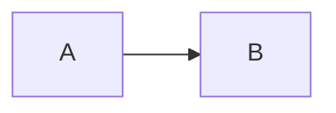

```markdown
flowchart LR
A --> B
```

---

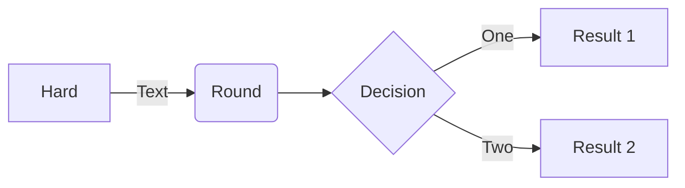

```markdown
flowchart LR

    A[Hard] -->|Text| B(Round)
    B --> C{Decision}
    C -->|One| D[Result 1]
    C -->|Two| E[Result 2]

```

---

##### Graph TD

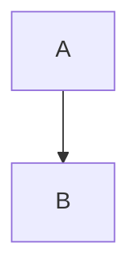

```markdown
graph TD
    A-->B
```

---


```markdown
graph TD
    A-->B
    A-->C
    B-->D
    C-->D

```

---

##### PIE

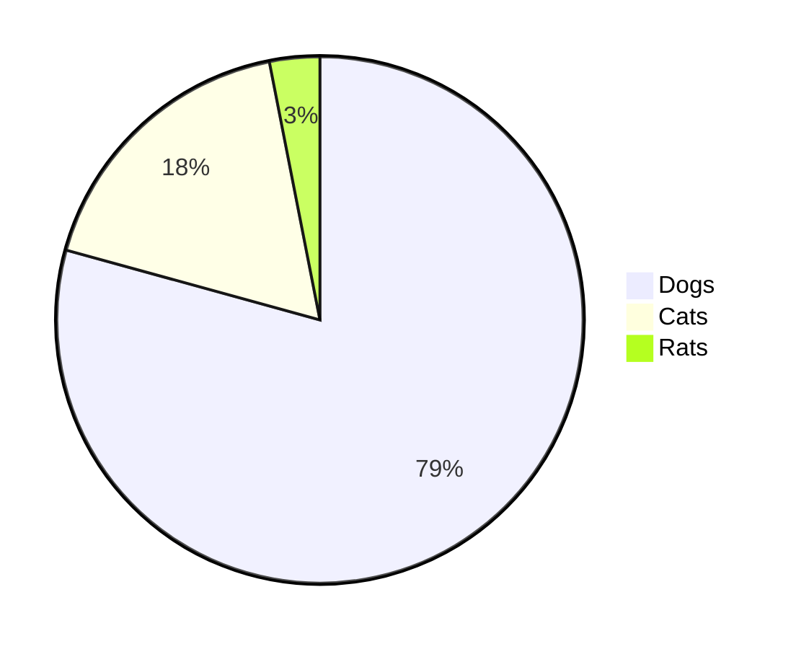

```markdown
pie
"Dogs" : 386
"Cats" : 85.9
"Rats" : 15
```

---

##### ER Diagram

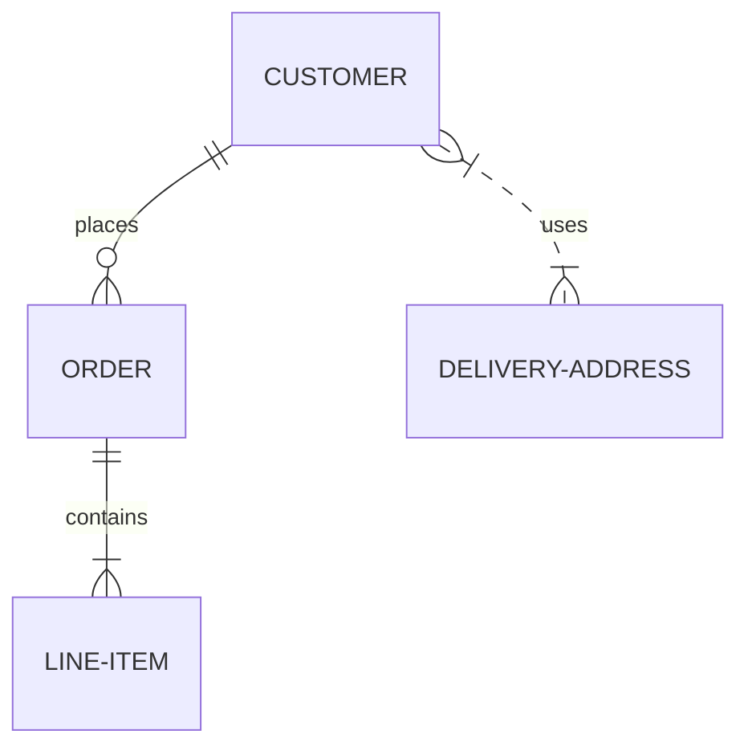

```markdown
erDiagram
    CUSTOMER ||--o{ ORDER : places
    ORDER ||--|{ LINE-ITEM : contains
    CUSTOMER }|..|{ DELIVERY-ADDRESS : uses

```

---

##### XY Chart

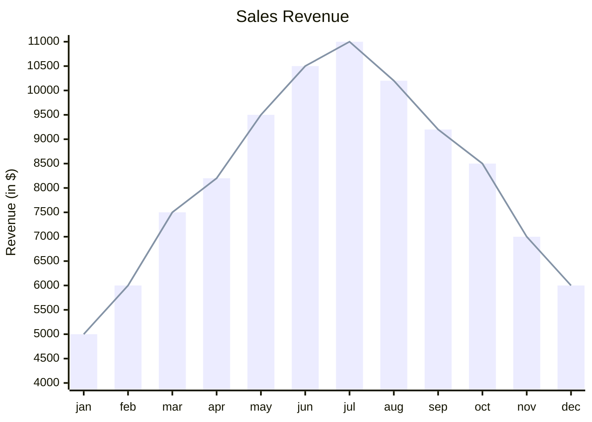

```markdown
xychart-beta
    title "Sales Revenue"
    x-axis [jan, feb, mar, apr, may, jun, jul, aug, sep, oct, nov, dec]
    y-axis "Revenue (in $)" 4000 --> 11000
    bar [5000, 6000, 7500, 8200, 9500, 10500, 11000, 10200, 9200, 8500, 7000, 6000]
    line [5000, 6000, 7500, 8200, 9500, 10500, 11000, 10200, 9200, 8500, 7000, 6000]
```

---

##### Sequence Diagram

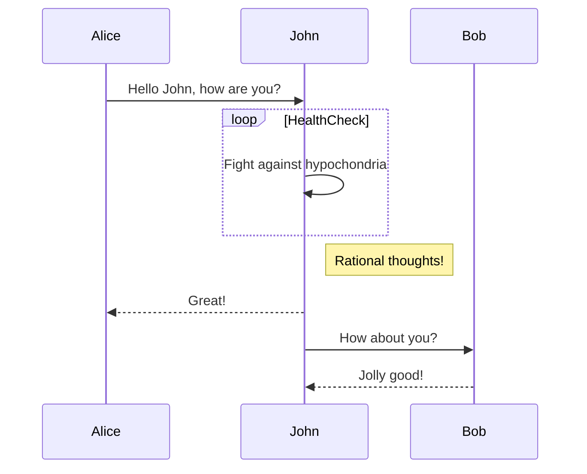

```markdown
sequenceDiagram
    Alice->>John: Hello John, how are you?
    loop HealthCheck
        John->>John: Fight against hypochondria
    end
    Note right of John: Rational thoughts!
    John-->>Alice: Great!
    John->>Bob: How about you?
    Bob-->>John: Jolly good!
```

---

##### GrantT

```mermaid
gantt
    title Git Issues - days since last update
    dateFormat  X
    axisFormat %s

    section Issue19062
    71   : 0, 71
    section Issue19401
    36   : 0, 36
    section Issue193
    34   : 0, 34
    section Issue7441
    9    : 0, 9
    section Issue1300
    5    : 0, 5
```

```mardown
gantt
    title Git Issues - days since last update
    dateFormat  X
    axisFormat %s

    section Issue19062
    71   : 0, 71
    section Issue19401
    36   : 0, 36
    section Issue193
    34   : 0, 34
    section Issue7441
    9    : 0, 9
    section Issue1300
    5    : 0, 5
```

---

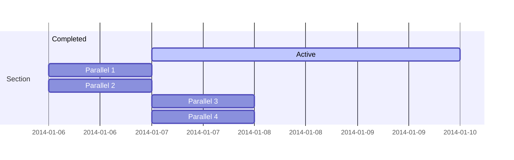

```markdown
gantt
    section Section
    Completed :done,    des1, 2014-01-06,2014-01-08
    Active        :active,  des2, 2014-01-07, 3d
    Parallel 1   :         des3, after des1, 1d
    Parallel 2   :         des4, after des1, 1d
    Parallel 3   :         des5, after des3, 1d
    Parallel 4   :         des6, after des4, 1d
```

---

##### Class Diagram

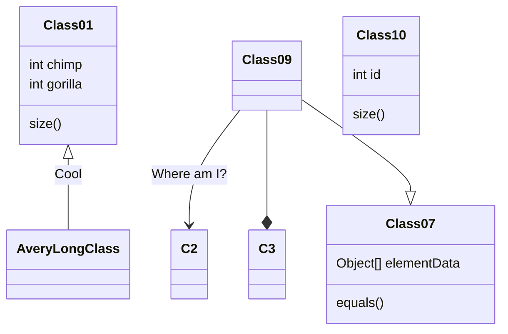

```markdown
classDiagram
    Class01 <|-- AveryLongClass : Cool
     Class01
    Class09 --> C2 : Where am I?
    Class09 --* C3
    Class09 --|> Class07
    Class07 : equals()
    Class07 : Object[] elementData
    Class01 : size()
    Class01 : int chimp
    Class01 : int gorilla
    class Class10 {
    int id
    size()
    }
```

---

##### Journey

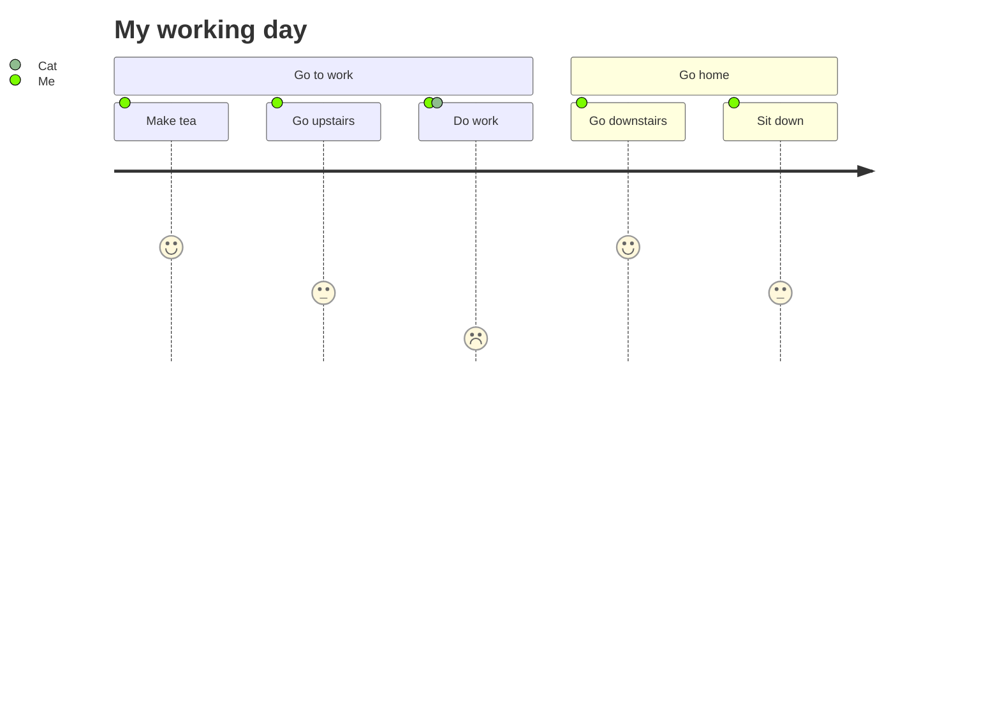

```markdown
journey
title My working day
    section Go to work
        Make tea: 5: Me
        Go upstairs: 3: Me
        Do work: 1: Me, Cat
    section Go home
        Go downstairs: 5: Me
        Sit down: 3: Me
```

---

##### Quadrant Chart


##### Quardrant Chart

```markdown
quadrantChart
    title Reach and engagement of campaigns
    x-axis Low Reach --> High Reach
    y-axis Low Engagement --> High Engagement
    quadrant-1 We should expand
    quadrant-2 Need to promote
    quadrant-3 Re-evaluate
    quadrant-4 May be improved
    Campaign A: [0.3, 0.6]
    Campaign B: [0.45, 0.23]
    Campaign C: [0.57, 0.69]
    Campaign D: [0.78, 0.34]
    Campaign E: [0.40, 0.34]
    Campaign F: [0.35, 0.78]

```

---

##### C4 Context

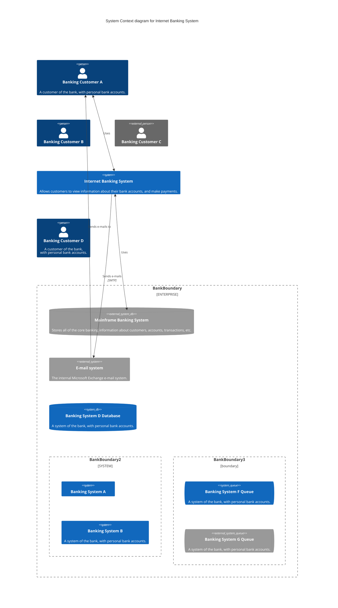

```markdown
C4Context
    title System Context diagram for Internet Banking System

    Person(customerA, "Banking Customer A", "A customer of the bank, with personal bank accounts.")
    Person(customerB, "Banking Customer B")
    Person_Ext(customerC, "Banking Customer C")
    System(SystemAA, "Internet Banking System", "Allows customers to view information about their bank accounts, and make payments.")

    Person(customerD, "Banking Customer D", "A customer of the bank, <br/> with personal bank accounts.")

    Enterprise_Boundary(b1, "BankBoundary") {

    SystemDb_Ext(SystemE, "Mainframe Banking System", "Stores all of the core banking information about customers, accounts, transactions, etc.")

    System_Boundary(b2, "BankBoundary2") {
        System(SystemA, "Banking System A")
        System(SystemB, "Banking System B", "A system of the bank, with personal bank accounts.")
    }

    System_Ext(SystemC, "E-mail system", "The internal Microsoft Exchange e-mail system.")
    SystemDb(SystemD, "Banking System D Database", "A system of the bank, with personal bank accounts.")

    Boundary(b3, "BankBoundary3", "boundary") {
        SystemQueue(SystemF, "Banking System F Queue", "A system of the bank, with personal bank accounts.")
        SystemQueue_Ext(SystemG, "Banking System G Queue", "A system of the bank, with personal bank accounts.")
    }
    }

    BiRel(customerA, SystemAA, "Uses")
    BiRel(SystemAA, SystemE, "Uses")
    Rel(SystemAA, SystemC, "Sends e-mails", "SMTP")
    Rel(SystemC, customerA, "Sends e-mails to")

```

---

#### Install

```bash
npm i mermaid

```

##### Mermaid API

```html
<script type="module">
  import mermaid from 'https://cdn.jsdelivr.net/npm/mermaid@11/dist/mermaid.esm.min.mjs';
  mermaid.initialize({ startOnLoad: true });
</script>
```
